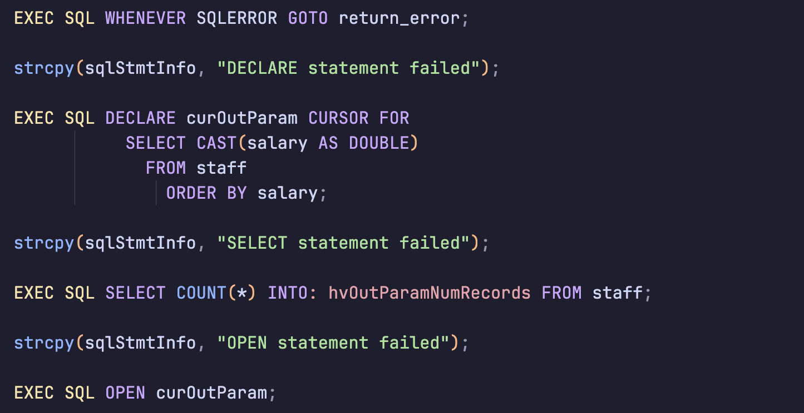

# Db2 embedded SQL syntax for C/C++

## Features

This extension provides syntax highlighting and snippets for [Db2 embedded SQL statements in C/C++ code][examples].

- Syntax highlighting for embedded SQL statements in C/C++ files
- Enhanced C syntax highlighting via Better C Syntax
- Full support for .sqc files (C source files with embedded IBM Db2 SQL)
- Snippets for common SQL operations

## Release Notes

### 0.3.0

- Enhanced C syntax highlighting from Better C Syntax project
- Added support for .sqc files (C source files with embedded IBM Db2 SQL)

### 0.2.0

Some snippets for SQL statements added

### 0.1.0

Initial release with basic syntax highlighting for embedded SQL keywords, types and functions

## Snippets

Below is a list of all available snippets and the triggers of each one. The **⇥** means the `TAB` key.

|  Trigger       | Content                                  |
| -------------: | ---------------------------------------- |
|   `db2declhv→` | Declare host variables section           |
|  `db2declcur→` | Declare cursor                           |
|  `db2opencur→` | Open cursor                              |
|    `db2fetch→` | Fetch from cursor                        |
| `db2closecur→` | Close currsor                            |
|      `db2inc→` | Include member (SQLCA, SQLDA or custom)  |
|   `db2select→` | Select                                   |
|   `db2commit→` | Commit                                   |

## SQC Files

This extension provides full syntax highlighting for .sqc files, which are C source files containing embedded SQL statements. These files are commonly used in IBM Db2 application development.

The syntax highlighting combines:
1. Enhanced C language syntax from the Better C Syntax project
2. Embedded SQL syntax for Db2 statements

[examples]: https://www.ibm.com/docs/en/db2-for-zos/12.0.0?topic=statements-c-c-programming-examples